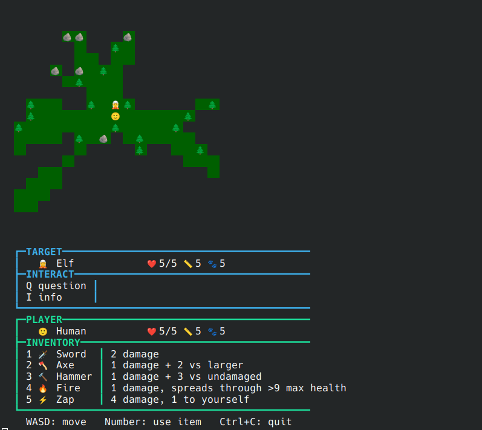

# FontFantasy

This game is played in the console, using ansi codes for colors and unicode characters for graphics.
It's a simple adventure fantasy game.

## Units

Units can ride friendly others that are at least twice their size.

🙂 Human 
5 size, 5 health, 5 speed 
Often carries a sword.

🧝 Elf 
5 size, 5 health, 7 speed

🧔 Dwarf 
3 size, 9 health, 3 speed 
Often carries a hammer.

🧔 Halfling 
3 size, 3 health, 7 speed 
Often carries an axe.

🧙 Wizard 
5 size, 5 health, 4 speed 
All of them can cast fireballs.

👺 Goblin 
2 size, 3 health, 5 speed 
Often carries a sword.

👹 Orc 
6 size, 6 health, 6 speed 
Often carries a hammer.

💀 Skeleton 
5 size, 3 health, 4 speed 
Often carries a sword.

🧟 Zombie 
5 size, 3 health, 3 speed 
Can throw some fists. Also bites.

🧛 Vampire 
5 size, 5 health, 5 speed 
Bites.

😈 Demon 
9 size, 5 health, 5 speed 
Can throw some fists. 

🗿 Golem 
12 size, 9 health, 2 speed 
Often carries a hammer.

🐉 Dragon 
15 size, 25 health, 5 speed 
Spews fire.

🐒 Monkey 
3 size, 5 health, 9 speed

🫧 Slime 
1 size, 9 health, 3 speed

🐇 Rabbit 
1 size, 3 health, 10 speed

🦁 Lion 
10 size, 5 health, 5 speed 
Bites

🦄 Unicorn 
10 size, 9 health, 9 speed 
Bites

🐍 Snake 
3 size, 5 health, 5 speed 
Bites

🐎 Horse 
10 size, 5 health, 9 speed

🌲 Tree 
18 size, 9 health, 0 speed

🪨 Rock 
5 size, 5 health, 0 speed
